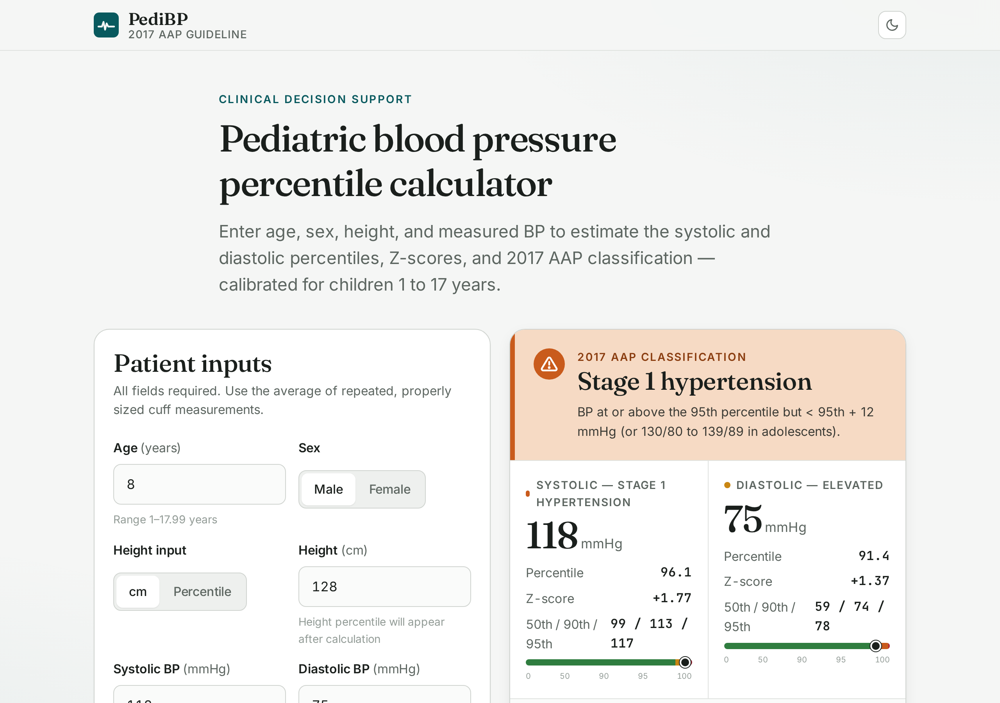

# PediBP — Pediatric Blood Pressure Percentile Calculator

A lightweight, dependency-free web calculator that estimates pediatric systolic and
diastolic blood pressure percentiles, Z-scores, and AAP 2017 risk classification
(normal / elevated / stage 1 HTN / stage 2 HTN) from age, sex, height, and measured BP.

Built for screening and education — not for diagnosis.



---

## Features

- **AAP 2017 polynomial regression** for BP percentile and Z-score
- **CDC 2000 LMS height-for-age** with Box-Cox transform (cm ⇄ percentile)
- **Classification logic** that follows the AAP "whichever is lower threshold" rule
  for children < 13 years and adult absolute thresholds for adolescents ≥ 13 years
- **Color-coded risk display** (green / amber / orange / red)
- **Light + dark mode** with system preference detection
- **Mobile-friendly** responsive layout
- **No build step, no backend** — just open `index.html`

## Methodology

### Height Z-score

Height Z is computed from the **CDC 2000 stature-for-age LMS reference**
(ages 24–240 months, by sex), interpolated across age in months, using the Box-Cox
transform:

```
Z = ((X / M)^L − 1) / (L · S)
```

Inverse used when the user supplies a height percentile instead of cm.

### BP percentile and Z-score

Conditional mean BP given age and height-Z is calculated with the **AAP 2017
fourth-order polynomial regression** published in the AAP Clinical Practice
Guideline supplement and reproduced in [PMC11619695](https://pmc.ncbi.nlm.nih.gov/articles/PMC11619695/):

```
μ = β₀ + Σₖ βₖ · (age − 10)^k + Σₖ γₖ · (htZ)^k     for k = 1..4
Z = (BP − μ) / σ
percentile = Φ(Z) × 100
```

σ values used:

| Metric    | Boys σ  | Girls σ |
| --------- | ------- | ------- |
| Systolic  | 10.7128 | 10.4855 |
| Diastolic | 11.6032 | 10.9573 |

### Classification

- **< 13 years**: takes the higher category between the percentile-based threshold
  (< 90th / 90th–<95th / ≥ 95th / ≥ 95th + 12 mmHg) and the absolute mmHg threshold
  (120/80, 130/80, 140/90). This matches the AAP rule that uses whichever threshold
  is *lower* — a lower threshold maps to a higher category for any given BP value.
- **≥ 13 years**: adult absolute thresholds — 120/80 (elevated), 130/80 (stage 1),
  140/90 (stage 2).

## Validation cases

| Patient            | Input    | Expected     | Calculator |
| ------------------ | -------- | ------------ | ---------- |
| 8 y M, 128 cm      | 100 / 60 | Normal       | ✓          |
| 8 y M, 128 cm      | 118 / 75 | Stage 1 HTN  | ✓          |
| 14 y F, 160 cm     | 142 / 92 | Stage 2 HTN  | ✓          |
| 14 y M, 165 cm     | 125 / 75 | Elevated     | ✓          |
| 5 y F, 110 cm      | 110 / 68 | Elevated     | ✓          |
| 12 y M, 150 cm     | 135 / 82 | Stage 1 HTN  | ✓          |

Formula was also cross-checked against the worked example in PMC11619695 (138-month
female, height-Z = −1.063, SBP 105 → expected Z 0.183, calculated 0.210; DBP 65 →
expected Z 0.353, calculated 0.364).

## File structure

```
pedibp/
├── index.html      # markup, header, form, results panel, AAP reference tables
├── style.css       # design system: colors, typography, light/dark themes
├── app.js          # calculator logic, classification, form wiring
├── lms-data.js     # CDC 2000 stature-for-age LMS table (boys + girls)
├── README.md       # you are here
├── SETUP.md        # step-by-step guide to publishing on GitHub Pages
├── screenshot.png  # README preview image
├── LICENSE         # MIT
└── .gitignore
```


## Disclaimer

**This tool is intended for screening and educational use only.** It is not a
medical device, has not been FDA-cleared, and must not be used as the sole basis
for diagnosis or treatment decisions.

Per the AAP 2017 guideline, a diagnosis of pediatric hypertension requires
**three separate visits** with properly sized cuffs and average BP ≥ the relevant
threshold. The calculator does not assess for white-coat HTN, masked HTN, secondary
causes, or target-organ damage — all of which require in-person clinical evaluation.

Confirm all calculations against the original AAP tables before clinical use.

## References

1. Flynn JT, Kaelber DC, Baker-Smith CM, et al. Clinical Practice Guideline for
   Screening and Management of High Blood Pressure in Children and Adolescents.
   *Pediatrics.* 2017;140(3):e20171904.
   [https://publications.aap.org/pediatrics/article/140/3/e20171904/](https://publications.aap.org/pediatrics/article/140/3/e20171904/)
2. Regression coefficients reproduced from
   [https://pmc.ncbi.nlm.nih.gov/articles/PMC11619695/](https://pmc.ncbi.nlm.nih.gov/articles/PMC11619695/)
   and [https://pmc.ncbi.nlm.nih.gov/articles/PMC10679476/](https://pmc.ncbi.nlm.nih.gov/articles/PMC10679476/).
3. CDC 2000 Growth Charts — stature-for-age LMS parameters.
   [https://www.cdc.gov/growthcharts/percentile_data_files.htm](https://www.cdc.gov/growthcharts/percentile_data_files.htm)

## License

MIT — see [LICENSE](./LICENSE).

## Contributing

Issues and pull requests welcome. If you spot a calculation bug, please include
the patient inputs, the expected output (with source), and the value the
calculator produced.
